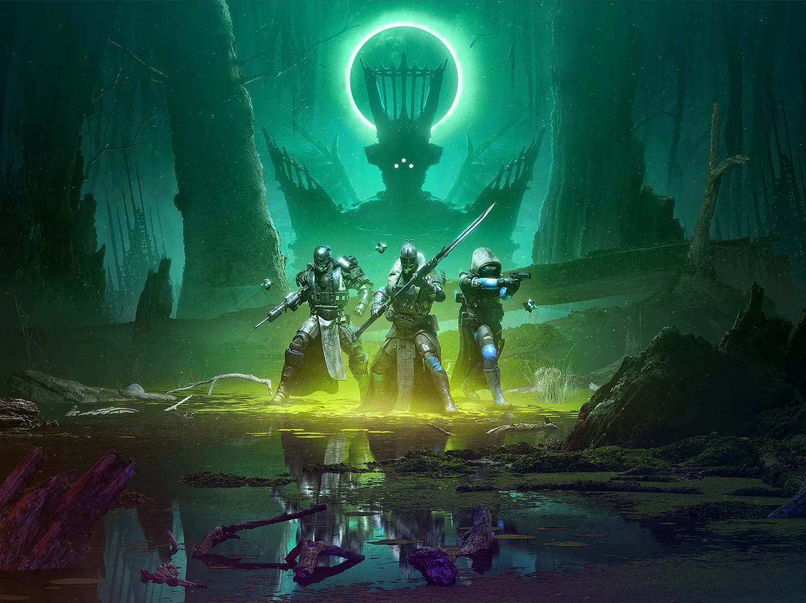

# Outbreak 
An Individual Game Project
## Overview
A multiplayer game featuring "Battle Royal" and "Raid (Destiny 2)" experiences, combinig PvP with PvE.
- 100 players max in one game
- 3D online first person shooter
- Theme: Sci-fi, Cyberpunk
- Reference games: Destiny 2, APEX, Cyberpunk 2077

- Reference movies: Blade Runner 2049


## Background Story
In 2243, our world is gradually being controlled by a mega corp, from   high-end chips to life neccessities. After years, the mega corp acquired its own land around the globe, built its own space station, and established private arm forces. The company is now developing a nano machine which is extremely valuable both medically and military. The lab in charge of the nano machine is situated under the sea bed of the Pacific Ocean.

## Gameplay
The game take place in the aforementioned undersea lab. Pieces of information about the maga crop developing a dangerous nano machine prototype is leaked. The company wants to cover it, so the crop blew up the container filling with nano machines and made the machines attack anyone they saw. Some of the researchers are killed immediately when the explosion started, yet around 100 researchers survived. Player will be one of the survived researchers and try to flee from the lab.
- Before the Battle
    - Before battle, players can choose to upgrade their attributes, including strength, intelligence, and so on. These attributes determine player's style of playing the game. 
    - For instance, if the player has **high strength** and encounters a door that needs to be unlocked, the player can force it to open using their high strength. In contrast, if the player has **high intelligence**, the player can hack the door open.
    ```cs
    public class AttributesOfPlayer
    {
        const int numberOfTypes = 2;

        [SerializeField]
        private NetworkVariable<float[]> attributes = new(new float[numberOfTypes], NetworkVariableReadPermission.Everyone, NetworkVariableWritePermission.Owner);
        public enum AttributeType
        {
            STRENGTH, INTELLIGENCE
        }

        public AttributesOfPlayer(float strength, float intelligence)
        {
            attributes.Value[(int)AttributeType.STRENGTH] = strength;
            attributes.Value[(int)AttributeType.INTELLIGENCE] = intelligence;
        }

        public void ChangeValueOfAttribute(AttributeType type, float delta)
        {
            var label = delta > 0 ? "Increased" : "decreased";
            ClientUIController.instance.indicationTextManager.DisplayHintTextOnUI($"{Math.Abs(delta)} {type.ToString().ToLowerInvariant()} {label}");
            attributes.Value[(int)type] += delta;
        }

        public bool CapableOf(AttributeType type, float requiredValue)
        {
            if (attributes.Value[(int)type] >= requiredValue)
            {
                ChangeValueOfAttribute(type, requiredValue * -1);
                return true;
            }
            ClientUIController.instance.indicationTextManager.DisplayHintTextOnUI($"Attribute {type.ToString().ToLowerInvariant()} doesn't meet the requirement");
            return false;
        }
    }
    ```
- During the Battle 
    - All the player will be deployed in ONE single map, spawned in a designated location randomly. 
    - In one game, players have to complete several Encounters to win a game - escape from the lab complex. Players are able to freely choose to team up with strangers or fight on their own during each Encounter. However,  certain number of players is recommended in one Encounter. (The number of players who can escape from the lab complex (e.g. The number of seats on the rescure boat) are random in each game. Players may have to fight with each other to successfully escape)
    - After being deployed in the battle, some of the player will suffer from infection of nano machine. Therefore, they have to complete Encounter 1 to acquire proper medical treatment to their body condition. There will be different route to flee from the lab. However, different route have different requirements on player's attributes. Therefore, players have to choose appropriate routes to successfully escape from the lab.
    
    - The description of routes can be found at "Twine_Project3.pdf", a script-like file created using Twinery.

- After the Battle
    - After successfully, or failing, to escape from the lab, players can strengthen their attributes using the experiences they gained for completing the battle. 
    - Player can also investigate on optimizing the selection of routes in one game.

## Engineering
- Encounter Desigin (Demo)
    The scene of Encounter 1 is designed using online resources with aid from teacher. Players have to collect the sufficient medicine, weapon, and ammunition in this building. Players also have to collect the recipe of the cure to the nano-machine infection. The cure can be crafted using craft table on Floor 2.
    The scene and mechanism of the scene to deisgned to encourage collaboration between players.
    - 1F
    After entering the main door, the building will enter lockdown mode, where main door cannot be open inside. The building will also initiate self-destruction sequence which will be completed in 10 minutes.
        - Scene Design
        
        - In game
        
        
    - 2F
    On Floor 2, players will encounter various rooms and enemies. Control room is where one player can open doors for the rest of their team. Player in the control room can also choose the whether power on or power off one of the rooms. Powering off one room will result in disabling of safety mechanism (there'll be no more enemies coming out) and insulating door (door can only be opened using force).
        - Scene Design
        
        - In game
        
        
    - 3F
    On Floor 3, at the end of the corridor, there's an emergency override button to disable the building's lockdown mode. However, after triggering the button, some of the floors (the red square) will collapse, opening a hatch to floor 2.
        - Scene Design
        
        - In game
        
        

- UI Design
    - The game's UI design emphasizes futurism to accomdate the settings.
    - Backpack panel design
    
    
    
    
    
      
    
- Scripts
    - The networking of the game is developed using [netcode](https://github.com/Unity-Technologies/com.unity.netcode.gameobjects); the development is maintained by implementing various interfaces. 
    - The scripts are original, without using any aid from teachers.
    - **The full scripts can be found at [https://github.com/M1zukiQAQ1/Project3_Multiplayer](https://github.com/M1zukiQAQ1/Project3_Multiplayer), including enemies' behavior tree, backpack system, and many more.**
    - **Demo videos demonstrating functions can be found at [https://drive.google.com/drive/folders/1o8o7_TZhfcqN2KUv-lMiRcJozxWxxOB0?usp=sharing](https://drive.google.com/drive/folders/1o8o7_TZhfcqN2KUv-lMiRcJozxWxxOB0?usp=sharing).**
    - Examples of scripts
        - Base class of interactable
        ```cs
        [RequireComponent(typeof(Collider))]
        public abstract class Interactable : NetworkBehaviour, IHintDisplayable
        {
            [Header("Interactable Modifier: Require Item")]
            public bool isRequireItemToInteract = false;
            public Item requiredItem;

            [Header("Interactable Modifier: Require Attribute")]
            public bool isRequirePlayersAttributesToInteract = false;
            public PlayerController.AttributesOfPlayer.AttributeType attributeType;
            public float requiredValue;

            [Header("Interactable Modifier: Require Hold")]
            public bool isRequireHoldToInteract = false;

            private NetworkVariable<bool> isInteracting = new(false, NetworkVariableReadPermission.Everyone, NetworkVariableWritePermission.Server);

            public bool GetIsInteracting() => isInteracting.Value;

            public virtual string GetHintText() => "Press F to Interact";

            public void DisplayHintText()
            {
                ClientUIController.instance.DisplayHintText(GetHintText(), transform);
            }

            [ServerRpc]
            public virtual void InteractServerRpc(ulong clientId)
            {
                isInteracting.Value = true;
                Debug.Log("Object Interacted");
            }

            [ServerRpc]
            public virtual void StopInteractServerRpc(ulong clientId)
            {
                isInteracting.Value = false;
                Debug.Log("Object stop being interacted");
            }

            protected bool CheckIfRequirementFullfilled(PlayerController playerInteracted)
            {
                var fullfilledItemRequirement = !isRequireItemToInteract || playerInteracted.backpack.IsContain(requiredItem.id);
                Debug.Log($"Interactable: fullfilled item requirement {fullfilledItemRequirement}");
                var fullfilledAttributeRequirement = !isRequirePlayersAttributesToInteract || playerInteracted.attributes.CapableOf(attributeType, requiredValue);
                Debug.Log($"Interactable: fullfilled attributes requirement {fullfilledAttributeRequirement}");
                return fullfilledAttributeRequirement && fullfilledItemRequirement;
            }
        }
        ```

        - Indication Text
        ```cs
        public class IndicationText : MonoBehaviour
        {
            [SerializeField] private float indicationTextHoldTime = 2f;
            [SerializeField] private float indicationTextFadeTime = 0.5f;
            [SerializeField] private int maximumTextAllowedInOneMessage = 25;
            [SerializeField] private int maximumTextAllowedOnScreen = 3;
            [SerializeField] private TMP_Text indicationTextPrefab;

            private Queue<string> textsToDisplay = new();
            private int totCurrentText = 0;
            
            public void DisplayHintTextOnUI(string textToDisplay)
            {
                if (textToDisplay.Length > maximumTextAllowedInOneMessage)
                {
                    for(int i = maximumTextAllowedInOneMessage; i >= 0; i--)
                    {
                        if(textToDisplay[i] == ' ')
                        {
                            textsToDisplay.Enqueue(textToDisplay.Substring(0, i));
                            textsToDisplay.Enqueue(textToDisplay[(i + 1)..]);
                            return;
                        }
                    }
                }

                textsToDisplay.Enqueue(textToDisplay);
            }

            private IEnumerator IEFadeAwayAndDestroyText(TMP_Text textObj)
            {
                float timer = 0;
                yield return new WaitForSecondsRealtime(indicationTextHoldTime);
                while(timer < indicationTextFadeTime)
                {
                    timer += Time.deltaTime;
                    float alpha = Mathf.Lerp(1, 0, timer / indicationTextFadeTime);
                    textObj.color = new Color(textObj.color.r, textObj.color.g, textObj.color.b, alpha);
                    yield return null;
                }
                textObj.color = new Color(textObj.color.r, textObj.color.g, textObj.color.b, 0);
                Destroy(textObj.gameObject);
                totCurrentText--;
            }

            // Update is called once per frame
            void Update()
            {
                if(totCurrentText < maximumTextAllowedOnScreen && textsToDisplay.Count > 0)
                {
                    var newText = Instantiate(indicationTextPrefab, transform).GetComponent<TMP_Text>();
                    newText.text = textsToDisplay.Dequeue();
                    totCurrentText++;
                    StartCoroutine(IEFadeAwayAndDestroyText(newText));
                }
            }
        }
        ```
*This converted PDF is created using markdown and may deviate from  original page design.*